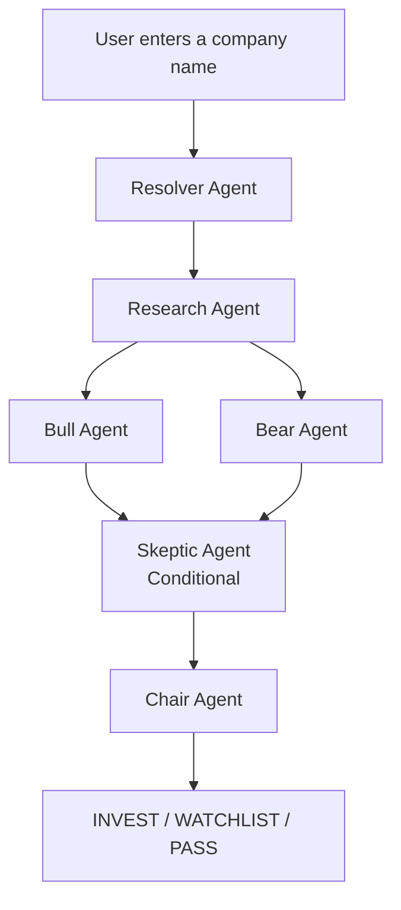

# Verdict

### Research. Debate. Decide.

A multi-agent investment research engine that evaluates a company through adversarial analysis and delivers a transparent verdict: **INVEST**, **WATCHLIST**, or **PASS**.

<p align="center">
  <a href="https://verdict-hazel.vercel.app">
    
  </a>
  <a href="https://github.com/rajsvmahendra/verdict">
    
  </a>
</p>

<p align="center">
  
  
  
  
</p>

---

Most investment tools provide information and leave the decision to the user.

Verdict takes a different approach.

A committee of specialized AI agents researches the company, debates both sides of the investment case, stress-tests assumptions, and produces a recommendation backed by structured reasoning and confidence scores.

---

| Research                                                                            | Evaluate                                                                | Decide                                                    |
| ----------------------------------------------------------------------------------- | ----------------------------------------------------------------------- | --------------------------------------------------------- |
| Gather company context, market position, financial signals, and recent developments | Bull, Bear, and Skeptic agents challenge assumptions and identify risks | Chair agent synthesizes the findings into a final verdict |

---

### Live Application

**https://verdict-hazel.vercel.app**

## How it actually works

When you type a company name, six agents run in a specific sequence:

**1. Resolver** — Figures out exactly which company you mean. Handles typos, ticker symbols, and ambiguous names. If it genuinely can't tell, it asks you to clarify instead of guessing.

**2. Research** — Pulls together the company's business model, recent news, market position, financials (where available), and competitive landscape. Explicitly marks any gaps — it never fills in missing information with guesses.

**3. Bull + Bear** — These two run at the same time, working from the same research. The Bull builds the strongest possible case for investing. The Bear builds the strongest possible case against. They don't see each other's work.

**4. Skeptic** — Only shows up when needed. If one side is clearly dominating or the confidence is borderline, the Skeptic reviews the winning argument and looks for claims that don't hold up or risks that were ignored.

**5. Chair** — Reads everything and delivers the final verdict. The verdict is determined by a fixed scoring table in code — the AI writes the explanation, but it cannot change the outcome.
## How It Works



---

## What each verdict means

**INVEST** — The bull case is meaningfully stronger than the bear case, confidence is high, and the data is reliable enough to trust the conclusion.

**WATCHLIST** — The case is genuinely mixed, or the data available was too thin to justify a strong call either way. This is not a weak outcome — it is an honest one. Most companies land here.

**PASS** — The risks clearly outweigh the upside. The bear case dominates and that conclusion is well-supported.

---

## The confidence system

Every verdict carries two separate scores:

- **Decision Confidence** — How clear-cut is the case? A large gap between bull and bear strength = high confidence. A close debate = low confidence.
- **Data Quality** — How much reliable information was actually available? Private companies and obscure firms score lower here — always explicitly, never silently.

These are tracked and reported separately. They are only combined at the final step.

One rule is load-bearing and enforced in code, not in a prompt:

> **A strong-looking case built on thin data will never produce an INVEST verdict.** If data quality is low, the result is always WATCHLIST — regardless of how compelling the bull case looks.

---

## Scoring methodology

Bull and Bear agents do not guess their scores. Each uses a weighted rubric:

**Bull score (strengthRating)**
| Dimension | Weight |
|---|---|
| Business quality / moat | 35% |
| Growth potential | 30% |
| Market position | 25% |
| Management execution | 10% |

**Bear score (severityRating)**
| Dimension | Weight |
|---|---|
| Competitive risk | 30% |
| Financial risk | 30% |
| Execution risk | 25% |
| External / macro risk | 15% |

If evidence for a dimension is missing or thin, that dimension scores low — it is never guessed upward.

---

## Verdict banding table

The Chair uses this table. It is implemented as branching code — not a prompt instruction.

| Decision Confidence | Data Quality | Verdict |
|---|---|---|
| High, bull dominant | High | INVEST |
| High, bear dominant | High or Low | PASS |
| Moderate or mixed | High | WATCHLIST |
| Anything | Low | WATCHLIST |

---

## Tech stack

| | |
|---|---|
| Framework | Next.js 16 (App Router) |
| Language | TypeScript — strict mode throughout |
| Agent orchestration | LangGraph.js v1.4.4 — real parallel branches, real conditional edges |
| LLM | Gemini 2.5 Flash via OpenRouter |
| Animations | Framer Motion |
| Styling | Tailwind CSS v4 |
| Deployment | Vercel |

---

## Project structure
```text
verdict/
├── app/
│   ├── api/analyze/              # POST endpoint that runs the full agent graph
│   ├── globals.css               # Design system tokens
│   └── page.tsx                  # Screen state manager (Input → Processing → Results)
│
├── components/
│   ├── input-screen.tsx          # Search, disambiguation, and error states
│   ├── processing-screen.tsx     # Live agent pipeline with skeleton preview
│   ├── results-screen.tsx        # Full verdict with explainability fields
│   └── ui/                       # Reusable primitives (badges, bars, logos, icons)
│
├── lib/
│   ├── agents/                   # One file per agent
│   │   ├── resolver.ts
│   │   ├── research.ts
│   │   ├── bull.ts
│   │   ├── bear.ts
│   │   ├── skeptic.ts
│   │   └── chair.ts
│   │
│   ├── gemini/                   # OpenRouter client and model configuration
│   └── api-client.ts             # Typed frontend fetch wrapper
│
├── types/
│   └── graph.ts                  # Shared typed state schema
│
└── docs/
    ├── decisions.md              # Architecture decision log
    └── build-log.md              # Debugging sessions and fixes
```

---

## Running it Locally

### Requirements

* Node.js 18+
* An OpenRouter API Key (free tier works)

### Installation

```bash
git clone https://github.com/rajsvmahendra/verdict.git
cd verdict
npm install
```

### Environment Setup

Create a `.env.local` file in the project root:

```env
OPENROUTER_API_KEY=your_key_here
```

### Start the Development Server

```bash
npm run dev
```

Open:

```text
http://localhost:3000
```

in your browser.

## Honest Limitations

* **Not financial advice.** Verdict is a research and reasoning tool, not a trading system.
* **Knowledge cutoff.** The underlying model does not have live market data. Very recent events may not be reflected in the analysis.
* **Private companies.** Limited public information naturally results in lower Data Quality Confidence scores. This is intentional behavior, not a bug.
* **Sources are knowledge-based.** At the current stage, sources describe the type of information used rather than providing live citations. Real-time source attribution is planned for a future version.
* **Analysis takes 20–60 seconds.** Each evaluation triggers multiple LLM calls across several agents, some running sequentially and others in parallel. Faster responses would require sacrificing depth, explainability, or accuracy.

---

## What Is Deliberately Not Included

These omissions are intentional design decisions:

* **No chat interface.** Verdict is a decision-support tool, not a conversational assistant.
* **No saved history.** Every analysis run is independent and stateless.
* **No financial market APIs.** Research is generated from the model's knowledge and evaluated through confidence scoring rather than live market feeds.
* **No hardcoded company-specific logic.** The same prompts, scoring rubrics, and decision framework are applied consistently regardless of the company being analyzed.

---

### Built With

**TypeScript · LangGraph.js · OpenRouter · Next.js · Framer Motion**

