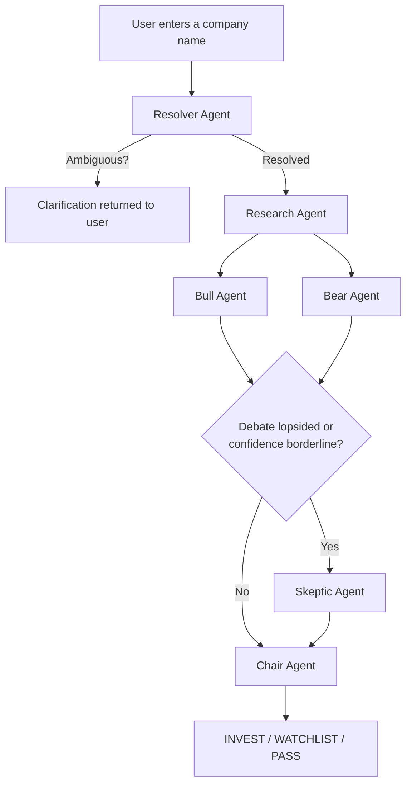

# Verdict — AI Investment Research Engine

> Research. Debate. Decide.

A multi-agent investment research system that evaluates any company through adversarial analysis and delivers a structured verdict: **INVEST**, **WATCHLIST**, or **PASS**.

---

## Overview

Most investment research tools hand you information and leave the interpretation to you. Verdict takes a different approach — it runs a structured committee process over your query and hands back a decision with full reasoning.

The core idea is adversarial debate. A Bull agent and a Bear agent independently construct the strongest case for and against investing, working from the same research data. A Skeptic agent conditionally stress-tests whichever side is winning. A Chair agent then synthesizes everything and applies a deterministic verdict logic implemented in code — not delegated to a prompt.

A single-prompt approach was deliberately avoided. One model asked "should I invest in X?" will rationalize toward a confident answer regardless of evidence quality. The multi-agent structure forces explicit disagreement, surfaces gaps in the data, and keeps the final decision tied to inspectable scoring logic.

---

## Live Demo

**[https://verdict-hazel.vercel.app](https://verdict-hazel.vercel.app)**

Works with public companies, private companies, stock tickers, and even typos.

---

## Features

- Six specialized agents with distinct roles and non-overlapping responsibilities
- True parallel execution — Bull and Bear run simultaneously from shared research
- Conditional Skeptic invocation — only fires when the debate is lopsided or confidence is borderline
- Deterministic verdict banding — the Chair follows a fixed decision table in code
- Two separate confidence scores: Decision Confidence and Data Quality
- Explicit handling of low-data companies — never fabricates information
- Company disambiguation — handles typos, tickers, and ambiguous names
- Full explainability output — every verdict includes five structured reasoning fields
- Animated processing screen showing real agent pipeline progression
- Company logo resolution with cascade fallback (Clearbit → Google → DuckDuckGo)

---

## Tech Stack

| Layer | Technology |
|---|---|
| Framework | Next.js 16 (App Router) |
| Language | TypeScript — strict mode throughout |
| Agent Orchestration | LangGraph.js v1.4.4 |
| LLM | Groq — `llama-3.3-70b-versatile` (primary), `llama-3.1-8b-instant` (fallback) |
| Animations | Framer Motion |
| Styling | Tailwind CSS v4 |
| Deployment | Vercel |

---

## Architecture

The graph is implemented using LangGraph.js with real parallel branches and conditional edges — not a sequential chain. Bull and Bear nodes receive the same state and execute concurrently. The Skeptic edge is a conditional branch that fires or is bypassed based on rating spread and confidence band, evaluated after the parallel merge.

Agent Responsibilities
Resolver
Receives raw user input and identifies the exact company. Handles typos, common name variants, and stock tickers. If the input matches multiple plausible companies with no clear winner, it routes to a clarification response rather than guessing. Writes resolvedEntity to state including name, ticker, description, and resolution confidence.

Research
Takes the resolved entity and gathers structured evidence: business model, recent developments, market position, competitive landscape, and financial snapshot where available. Calculates a dataCompleteness score across four dimensions — this score directly drives the Data Quality Confidence in the final verdict. If information is missing or thin, the field is explicitly marked as insufficient rather than papered over.

Bull
Builds the strongest possible evidence-backed case for investing. Reads only from researchData — no external knowledge beyond what the Research agent surfaced. Scores four dimensions using a weighted rubric:

Dimension	Weight
Business quality / moat	35%
Growth potential	30%
Market position	25%
Management execution	10%
The strengthRating is a calculated decimal — not an LLM-guessed integer.

Bear
Runs in parallel with Bull. Builds the strongest possible case against investing from the same research data. Scores four risk dimensions:

Dimension	Weight
Competitive risk	30%
Financial risk	30%
Execution risk	25%
External / macro risk	15%
Both agents receive the same researchData and produce independent outputs with no visibility into each other's reasoning.

Skeptic
Conditionally invoked after Bull and Bear complete. Fires when:

The gap between strengthRating and severityRating exceeds 4 points (lopsided debate), or
The preliminary confidence falls between 40% and 70% (borderline band)
When invoked, the Skeptic reviews whichever case is winning and produces flaggedClaims, missingConsiderations, and an adjustedConfidenceDelta (always ≤ 0). When skipped, the skip reason is recorded in state and rendered in the UI.

Chair
Reads all prior agent outputs and produces the final verdict. The verdict is determined by a deterministic banding table implemented as branching code in lib/agents/chair.ts. The LLM is then called to write the narrative explanation — it explains the outcome but cannot change it. Also populates all five Section 4a explainability fields required by the architecture.

Confidence System
Two scores are tracked separately throughout the pipeline and combined only at the Chair step.

Decision Confidence measures how clear-cut the investment case is. It is derived from the gap between bullCase.strengthRating and bearCase.severityRating, normalized to 0–1, then adjusted by the Skeptic's adjustedConfidenceDelta if the Skeptic was invoked.

Data Quality Confidence measures how much reliable information was actually available. It comes directly from the Research agent's dataCompleteness calculation — a weighted score across business model quality, financial data availability, recent news availability, and market data availability.

These are intentionally kept separate because a company can have a very clear investment case while having limited public data, or vice versa. Collapsing them into one number hides information that affects how much weight you should give the verdict.

Verdict Logic
The Chair applies this table. It is code, not a prompt:

Decision Confidence	Data Quality	Verdict
High (≥65%) + bull dominant	High (≥50%)	INVEST
High (≥65%) + bear dominant	High or Low	PASS
Moderate / mixed	High (≥50%)	WATCHLIST
Anything	Low (<50%)	WATCHLIST
The last row is intentional and load-bearing: a strong-looking bull case built on thin data resolves to WATCHLIST, never INVEST. This constraint is enforced in determineVerdict() in lib/agents/chair.ts and cannot be overridden by the LLM's narrative output.

Project Structure
text

verdict/
├── app/
│   ├── api/
│   │   ├── analyze/              # POST /api/analyze — runs the full LangGraph pipeline
│   │   └── test-gemini/          # GET /api/test-gemini — Groq connection test
│   ├── globals.css               # Tailwind v4 design system with @theme tokens
│   ├── layout.tsx                # Root layout with font configuration
│   └── page.tsx                  # Screen state manager (input → processing → results)
│
├── components/
│   ├── input-screen.tsx          # Search input, chip shortcuts, error and clarification states
│   ├── processing-screen.tsx     # Animated agent pipeline with progress bar and skeleton preview
│   ├── results-screen.tsx        # Full verdict rendering with all explainability fields
│   └── ui/
│       ├── company-logo.tsx      # Logo resolution: Clearbit → Google → DuckDuckGo → initials
│       ├── confidence-bar.tsx    # Animated confidence bars (Framer Motion)
│       ├── icons.tsx             # SVG icon set (no emoji anywhere in the codebase)
│       ├── scroll-reveal.tsx     # Intersection Observer scroll animations
│       ├── skeleton-loader.tsx   # Skeleton loading cards shown during Chair synthesis
│       ├── spinner.tsx           # Loading spinner
│       └── verdict-badge.tsx     # INVEST / WATCHLIST / PASS badge
│
├── lib/
│   ├── agents/
│   │   ├── resolver.ts           # Entity resolution with structured JSON output
│   │   ├── research.ts           # Evidence gathering with explicit data completeness scoring
│   │   ├── bull.ts               # Bullish case builder with weighted rubric scoring
│   │   ├── bear.ts               # Bearish case builder with weighted rubric scoring
│   │   ├── skeptic.ts            # Conditional stress-tester with confidence delta output
│   │   └── chair.ts              # Deterministic verdict banding + LLM narrative synthesis
│   ├── gemini/
│   │   ├── client.ts             # Groq SDK client with model fallback logic
│   │   └── index.ts              # Barrel export
│   ├── api-client.ts             # Type-safe frontend fetch wrapper
│   └── env.ts                    # Typed environment variable loader with hard boot failure
│
├── types/
│   └── graph.ts                  # VerdictGraphState — single typed schema used by all agents
│
└── docs/
    ├── decisions.md              # Dated architecture decision log
    └── build-log.md              # Debugging session log
Running Locally
Requirements: Node.js 18+, a Groq API key (free tier works)

Bash

git clone https://github.com/rajsvmahendra/verdict.git
cd verdict
npm install
Create .env.local in the project root:

env

GROQ_API_KEY=your_groq_api_key_here
Bash

npm run dev
Open http://localhost:3000.

Design Decisions
LangGraph over a sequential chain
The architecture requires genuine parallel execution (Bull and Bear run simultaneously) and conditional routing (Skeptic invokes only when needed). A sequential chain cannot express either of these. LangGraph provides a real directed graph with typed state, parallel branches, and inspectable conditional edges.

Parallel Bull and Bear execution
Running them simultaneously from the same research data ensures they cannot anchor on each other's framing. It also reduces total latency — the two most token-heavy agents run concurrently rather than sequentially.

Conditional Skeptic
A Skeptic that always runs adds latency and API cost without adding value on balanced debates. The conditional gate (lopsided ratings or borderline confidence) ensures the Skeptic intervenes exactly when it is useful.

Deterministic Chair logic
LLMs will rationalize. Giving the Chair free rein to decide the verdict based on its own synthesis would make the outcome unpredictable and unauditable. The banding table is code. The LLM writes the explanation. The two responsibilities are explicitly separated.

Strict TypeScript state schema
Every agent reads from and writes to VerdictGraphState defined in types/graph.ts. No agent uses any. This makes the data flow auditable — you can trace any value in the final verdict back to which agent wrote it and what input it came from.

Explainability as a required output
Every verdict must populate five fields: why the verdict, strongest bull argument, strongest bear argument, Skeptic challenge (or skip reason), and Chair reasoning. These are validated at the API route level — a response without them is incomplete regardless of whether a verdict badge rendered.

Trade-offs
No live financial APIs. Research comes from the model's training knowledge, not real-time market data. This keeps the system self-contained and avoids API cost and latency from financial data providers, at the cost of recency.

Stateless execution. Each analysis run is independent. There is no persistent history, no watchlist, no re-evaluation. Every run starts from scratch.

Higher latency for better reasoning. A full run takes 20–60 seconds. Each agent makes at least one LLM call. Some run sequentially (Resolver → Research) and some in parallel (Bull + Bear). Reducing latency would require either fewer agents or cheaper models — both would reduce output quality.

Knowledge-based sources. Sources describe the type of information used (e.g., "Company 10-K filing", "Reuters news coverage") rather than providing live URLs. Real citation linking requires either a retrieval system or a web-search-enabled model.

Example Runs
Apple (AAPL)
Apple's bull case centered on ecosystem lock-in, services revenue growth, and strong brand loyalty. The bear case flagged App Store regulatory risk, hardware saturation, and reliance on third-party AI partnerships. The Skeptic noted missing quantification of Digital Markets Act impact. Decision confidence landed at 53% — not high enough to clear the 65% threshold. Verdict: WATCHLIST.

Nvidia (NVDA)
Nvidia's bull case was strong — dominant AI accelerator market share, CUDA ecosystem moat, and record data center revenue growth. Bear risks included valuation concentration, China export restrictions, and AMD competitive pressure. The Skeptic invoked and flagged the absence of specific margin sustainability data. Despite the Skeptic's -0.20 confidence adjustment, decision confidence remained at 0.68. Verdict: INVEST.

Midjourney
As a private company with limited public financial data, the Research agent returned low data completeness. The bull case identified strong brand recognition and early market leadership in AI image generation. The bear case flagged intense competition from Adobe, OpenAI, and Stability AI with no clear moat beyond current brand position. Data Quality Confidence scored below the 50% threshold. Regardless of the debate outcome, the low data quality rule applies. Verdict: WATCHLIST.

Limitations
The model has a training knowledge cutoff. Very recent developments may not be captured.
Private companies and obscure firms naturally produce lower Data Quality scores due to limited public information. This is correct behavior.
The system is not connected to real-time financial data. Stock prices, earnings, and breaking news are not reflected unless they are within the model's training data.
Analysis takes 20–60 seconds per run. This is a function of the number of LLM calls, not a bug.
Sources are knowledge-based descriptions, not live citations with URLs.
Future Improvements
Streaming agent output — show each agent's reasoning as it is generated rather than waiting for the full pipeline
RAG with live data — connect to financial data APIs and news feeds for real-time research grounding
Persistent history — save and re-evaluate past verdicts, track how a company's score changes over time
Inline citations — link every claim to a specific source URL
Shareable verdicts — generate a permalink for each analysis
Multi-model routing — use a faster model for research and disambiguation, stronger model for synthesis
PDF export — generate a structured research memo from the verdict output
Built With
Next.js · TypeScript · LangGraph.js · Groq · Tailwind CSS v4 · Framer Motion · Vercel